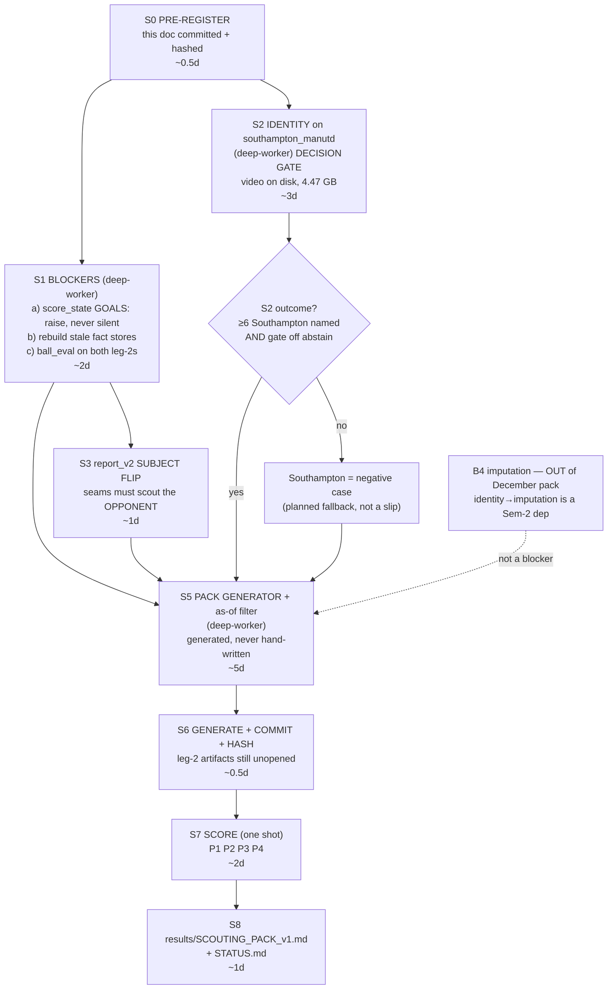

# SCOUTING_PACK_PLAN — the December centrepiece, pre-registered build plan (2026-07-26)

Extends `docs/BTP_DECEMBER_PLAN.md` (§B3 "demo shape decided", §B5 "centerpiece demo") and
`results/FORECAST_V0.md` (the six-pair backtest whose protocol this reuses and hardens).
This is a **college BTP deliverable reviewed December 2026 — not a paper submission**
(BTP_DECEMBER_PLAN §B5, dropped 2026-07-24). Rigour is for the viva, not a venue.

Purpose of this document: to be written **before** anything is generated, so that mid-build we do
not discover we should have built it differently. Everything below is a commitment. Where it
contradicts an earlier plan, this document wins and says so.

---

## 1. FEASIBILITY VERDICT

**YES, WITH SCOPE CUTS — and one of the two locked demo fixtures is not what we think it is.**
We can build a defensible pre-match opposition scouting pack from what is on disk, but only if it
is a *team-and-phase-level* pack whose headline forecast is possession, with per-player content cut
to near zero and set pieces cut entirely. **The Brighton pair carries the demo. The Southampton
pair, as currently scoped, cannot carry a second success story and must be re-cast as the honest
failure case** — or it will fail in front of the supervisor rather than in this document.

### Why yes

The pack's spine already exists and is validated end to end. Possession-link share is the one
cross-leg-stable signal we own (r = +0.83) and it already beat both baselines in a pre-registered
forecast — MAE 7.92 pp vs uninformative 10.63 and Elo-only 12.18 (`results/FORECAST_V0.md` §a).
Pass counts hold at 0.97–1.09× official on 10/12 matches on a threshold **frozen at the first match
and never retuned** — which is precisely the discipline Cawley & Talbot say is the difference
between a real result and a selection-bias artifact (https://www.jmlr.org/papers/volume11/cawley10a/cawley10a.pdf).
Goal timing on three of the four relevant fixtures matches the Sofascore oracle exactly by half. An
evidence gate with a real abstain tier already runs. That is a genuine pre-match artifact, not a
mock-up.

The architecture is also externally defensible. Forecasting an intermediate *statistic* and letting
the outcome follow is exactly Wheatcroft's two-stage design (https://arxiv.org/pdf/2001.09097), and
opponent-conditioned features dominating self-referential ones has an independent precedent
(https://www.ncbi.nlm.nih.gov/pmc/articles/PMC10955747/, adj. R² 0.82). Broadcast-derived pass
*counts* holding up while finer claims do not is confirmed by the FIFA-funded benchmark
(https://shura.shu.ac.uk/37410/1/Mills-AutomaticEventDetection(VoR).pdf) — same structural result
as our own BAS validation.

### Why "with scope cuts" — the four things being cut now, before we build them

1. **Set pieces are cut.** Real practice gives them a dedicated section with a fixed checklist —
   delivery zone, taker, first contact, zonal vs man, keeper aggression, wall discipline
   (https://totalfootballanalysis.com/article/scout-reports-how-to-effectively-scout-your-opposition-tactical-analysis-tactics),
   and Liverpool give them a standing slot in the pre-match meeting
   (https://www.nacsport.com/blog/en-us/Users/part-1-opposition-analysis-liverpool-fc). We have
   **corner counts and nothing else** — no location, no taker, no first contact, no marking scheme.
   Shipping a set-piece section from counts alone would be the single most obviously hollow page in
   the pack. It is cut and named as a hole, not silently thinned.
2. **Per-player sections are cut to role-level statements.** Per-player event attribution is 1–4%
   of truth; pooled across all 9 identity matches the busiest player has 6 attributed passes against
   a 20-pass floor (`results/PLAYER_ANALYSIS_v2.md`). The professional player-report template
   (5 sections, offensive + defensive characteristics, 4–6 contextualised stats) would force our own
   gating layer to abstain on most of it — adopting it wholesale ships a thin section dressed as the
   professional standard. Rejected.
3. **B4 off-screen imputation is cut from the pack entirely.** It stays a separate validated module
   in the thesis. Rendering imputed positions as per-player facts in a *single-fixture* pack is the
   exact thing the practitioner audit says does not work at all at single-game/player level
   (19+ outfield players fully visible only 5% of the time across an EPL gameweek,
   https://medium.com/@arnaud_santin/football-data-finally-under-scrutiny-arnaudsantin-58c14ffe2d52),
   and the closest published analogue explicitly declines to claim imputed scores are more accurate
   on real footage (https://arxiv.org/abs/2607.11548). This also removes the "identity before
   imputation" blocker from the December critical path — it becomes a Semester-2 dependency, not a
   December one.
4. **We do not render second-leg reports.** The second leg is the *scoring target*, not a pack. It
   needs a small scoring extract (actual possession, result, block, counter-press, gate tier), not a
   full report_v2 render. This deletes the entire `render_scouting_v2` KeyError blocker from the
   critical path — see §5.

### The loud part: what is flawed in the plan as approved

**(a) The Southampton pair flips three things, not two.** The brief tracks "venue and manager both
flip". For the Southampton pair, Southampton *themselves* changed manager between the legs
(Russell Martin → Ivan Juric, Dec 2024) — verified in the prior-art pass, re-check before it enters
the thesis. Professional practice is explicit that a managerial change **on the scouted team's side**
is exactly the condition demanding *more* matches, not fewer, and that a single previous meeting is
the most relevant signal only when the opponent's manager is stable
(https://www.nacsport.com/blog/en-gb/Tips/how-many-games). Brighton's Hürzeler was stable across
both legs; Southampton's was not. So the two fixtures are not two samples of the same design —
Brighton is the design working, Southampton is the design's stated failure mode. Presenting them as
a matched pair of demos misrepresents both.

**(b) The Southampton pack has no possession claim and no players.** Its only source leg,
`southampton_manutd`, sits at report_v2 gate tier **abstain** (coverage 43.0% clears 40, recall proxy
26.0% misses 50, team spread 0.103 exceeds the 0.05 band), its space-control proxy **inverts** the
Sofascore oracle (`results/report_v2_southampton_manutd.md` line 69), and it has **zero identity
artifacts** — not one Southampton player can be named. Possession is the one validated forecastable
signal we have; on this fixture we cannot honestly assert it from our own CV. A pack whose headline
metric abstains is not a pack.

**(c) Nothing in the code enforces the pre-match cut-off the protocol declares.** Two live leaks:
the identity layer's oracle *is the actual match team sheet* (`results/identity/LINEUP_ASSIGN_*.md`
line 3), and the season style factors are **full-season 2024-25 FBref aggregates** with no as-of-date
filter — so Brighton's PC1/PC2/PC3 of +1.19/+0.89/+0.26 includes matches played *after* the
2025-01-19 fixture being forecast. FORECAST_V0's protocol claims a cut-off the repo does not
implement. This is the finding a December examiner will land on hardest.

**(d) The pack is scored only on being right, never on being useful.** Murphy's framework separates
quality from *value*: a forecast can be accurate and worth nothing if no decision would have turned
on it (https://journals.ametsoc.org/view/journals/wefo/8/2/1520-0434_1993_008_0281_wiagfa_2_0_co_2.xml),
and decision-level rankings can invert accuracy-level rankings (https://arxiv.org/pdf/2512.14779).
"So what?" is a fair supervisor question against a good MAE. §4 adds named binary decisions to close it.

### The resulting decision

| | Role | Headline claim |
|---|---|---|
| **Brighton pair** (`brighton_manutd` → `manutd_brighton`) | **PRIMARY DEMO** | Full pack, possession forecast, comparative tactical claims, thin named-player layer. Opponent manager stable — the design's fair test. |
| **Southampton pair** (`southampton_manutd` → `manutd_southampton`) | **STRESS / NEGATIVE CASE** | Same generator, same protocol, run honestly to the point where the gate refuses. The deliverable is *what the pack refuses to say and why*. Promoted back to a full demo **only if** S2 (§5) lands identity and lifts the gate off abstain. |

Framing Southampton as the case where the pipeline correctly declines is a stronger viva answer than
a second pack quietly leaning on Sofascore. The abstention layer refusing on a real fixture, in
front of the supervisor, *is* the thesis claim (BTP_DECEMBER_PLAN §1: "measures exactly what a
broadcast supports, proves where it stops, and reports nothing it cannot ground").

---

## 2. WHAT THE PACK CONTAINS

**Organising principle — chosen deliberately, not defaulted.** Practitioner opinion is split:
phase-by-phase walkthrough (build-up / progression / final third / transitions / set pieces) versus
objective-linked framing ("their strengths in attack" / "their weaknesses in defence") with every
observation tied to score-more-or-concede-less. We take the objective-linked framing
(https://totalfootballanalysis.com/article/scout-reports-how-to-effectively-scout-your-opposition-tactical-analysis-tactics)
because it matches our existing pundit-voice design and because a phase checklist would expose one
abstained cell per phase. Delivery shape follows Liverpool's split — a coach-level document plus a
much shorter player-level digest, rather than one flat report
(https://www.nacsport.com/blog/en-us/Users/part-1-opposition-analysis-liverpool-fc).

**Sizing target.** 8 sections, 3–6 evidence items each, matching the 20–30-items-in-themed-groups
convention (https://www.nacsport.com/blog/en-gb/Tips/top-10-tactical-insights). The professional
350→40–50 clip compression is a *directional* analogy for curation only — it describes a
multi-match full-footage video workflow and is **not** cited as an evaluation standard.

**Claim types.** `ABSOLUTE` = a number we assert on its own. `COMPARATIVE` = team-vs-team ratio
only, permitted under symmetric capture (spread ≤ 0.05), pre-approved by the supervisor
2026-07-24 (BTP_DECEMBER_PLAN §5.3). `ABSTAIN` = the gate refuses; the section renders the refusal
and the condition that would lift it.

**Hard rule, enforced in the generator, adopted from recruitment practice
(https://www.liamhenshaw.com/writing/how-to-write-a-football-scouting-report — note: that source is
a *player-recruitment* template, borrowed for this rule only, not for the pack's shape): no bare
metric ships without comparison context.** Every number carries a league or opponent reference or
it does not render. Second enforced rule, from
https://the-footballanalyst.com/how-to-structure-a-professional-scouting-report/ (an enthusiast
practitioner blog, cited as such): **concrete football-action language only** — any generated
sentence reducing to an ungrounded adjective ("strong", "good technique") is rejected exactly like
an abstained claim.

### Section spec

| # | Section | Fed by | Claim type |
|---|---|---|---|
| **0** | **Bottom line up front** — 5 numbered pre-match calls, each a binary decision, each scoreable. Recommendation first, never buried. | §4 P3 decision list; forecast card | `ABSOLUTE` (as *decisions*, not measurements) |
| **1** | **Fixture context + evidence inventory + confidence discount** — what we watched (n=1 broadcast), what we did not, the manager-change discount, the gate tier of the source leg, as-of date of every public input | `core.registry`, `outputs/eval/<id>_ball_eval.json`, clubelo snapshot, as-of-filtered FBref | `ABSOLUTE` (these are facts about our evidence, not about football) |
| **2** | **How they defend — block shape** (line height, low/mid/high shares, vertical spread, ball-to-block) | `results/BLOCK_AND_STYLE_v1.md`; Brighton 23.8 m / .728-.131-.141, Southampton 24.0 m / .719-.226-.055 | **`COMPARATIVE` ONLY.** Gate 1 hand-annotated line-height validation is PENDING and per-team broadcast bias on our two source legs is asymmetric by up to ~9 m (`brighton_manutd`: Utd +0.3 vs Brighton +9.4). Absolute metres are **withheld**; only within-fixture relative shares ship. |
| **3** | **How they attack — territory and control** | poss-link share, space control, `report_v2` ball families | Brighton: `COMPARATIVE` (source leg gate tier = comparative, spread 0.009, coverage 51.9%). **Southampton: `ABSTAIN`** (gate tier abstain; proxy inverts the oracle). |
| **4** | **Transition profile — counter-press and regain** | `fingerprint` counter-press (computes on demand; Brighton leg-2 measured 0.750 frac / 0.391 5s-regain over 92 losses) | `COMPARATIVE`. Note in-section: **cross-leg counter-press consistency has never been measured for any pair** (`PAIR_ANALYSIS_v1` Task 3) — this is a described tendency, not a validated-stable one. |
| **5** | **Attack typing — how they progress** | `GAME_STATE_v2`; 3-way coverage 9.5–14.6% on these fixtures | **`ABSTAIN` as a forecast.** LOPO attack-direction already scored at chance, 3/6 (`FORECAST_V0` §c). Ships as descriptive-with-coverage-stated, explicitly labelled not-predictive. Predicting direction is a **pre-registered known-negative**, not a hoped-for win. |
| **6** | **Set pieces** | corner counts only | **`ABSTAIN` — whole section.** Renders the professional checklist with every field marked *not measured*, and names what would be needed. A named hole beats a hollow page. |
| **7** | **Individuals — role-level only** | `outputs/identity/<id>_lineup_assign.parquet` (Brighton source leg: 7 Brighton named, mean conf 0.913), formation proxy | `COMPARATIVE`/`ABSTAIN` per player. Role-level statements only ("their right-sided centre-back is the one stepping into midfield"), never per-player event counts. **Southampton: `ABSTAIN` — zero identity on the source leg.** Broadcast-coverage limits stated in-section, as professionals do. |
| **8** | **Forecast card** | `FORECAST_V0` machinery | `ABSOLUTE` for possession point + 68%/90% band (the one validated forecast); `ABSOLUTE` for result distribution; `ABSTAIN` for attack direction |
| **9** | **Limits, and what would change our mind** | this document | `ABSOLUTE` |

**Companion digest (Liverpool's MD-1 analogue):** one page, 5–6 items, drawn *only* from sections 0
and 8. Generated by truncation from the coach pack — never written separately, so it cannot drift
from its evidence.

---

## 3. WHAT MUST NOT GO IN IT

| Excluded | Why |
|---|---|
| **Absolute defensive line heights in metres** | Gate 1 validation PENDING; ~7 m held-out uncertainty; every team in the corpus reads "low"; per-team broadcast bias up to ~9 m *within a single fixture*. Comparative shares only. |
| **Any shot, xG, or chance-quality claim as ours** | No CV shot detector exists. Every shot/xG figure in `PAIR_ANALYSIS_v1` is Sofascore. The FIFA benchmark independently finds broadcast shot detection tops out at F1 0.24 and saves at **F1 0.00 in every configuration** (https://shura.shu.ac.uk/37410/1/Mills-AutomaticEventDetection(VoR).pdf). Shots may appear **only** as clearly-attributed public context. |
| **Goalscorer or assist identification** | Never derived from video; `render_scouting_v2::_goal_timeline` already says so. Scorer team is a per-half Sofascore score delta. |
| **Per-player pass networks, progressive passes, per-player event counts** | Named pass edges = 0 on all four fixtures; corpus named pass rate 0.0–3.9%; pooling does not rescue it. |
| **Any positional assertion about a named player at a named moment** | Off-screen imputation is out of the pack (§1 cut 3); even in-frame, re-id recovery collapses to 8.66% after ~15 frames fully off-screen (https://arxiv.org/html/2512.08467v1). Aggregate/probabilistic phrasing only. |
| **Set-piece routines, delivery zones, takers, marking schemes** | Counts only exist. See §2 row 6. |
| **A predicted starting XI or availability call** | Nothing on disk carries injuries, suspensions or rotation. The identity oracle is the *actual* team sheet — a forward-looking XI from it is a direct leak of the fixture being forecast. |
| **Attack-direction prediction stated as a finding** | Already scored at chance under honest holdout. It ships as a known-negative, never as a claim. |
| **"New manager bounce" as an explanatory device** | Two independent causal designs find the average effect of a mid-season change indistinguishable from zero — n=331 matched-control, all 95% CIs spanning zero (https://www.tandfonline.com/doi/full/10.1080/02640414.2026.2698238), corroborated by entropy-balancing/market-odds identification (https://analyticsfc.co.uk/blog/2021/03/11/special-ones-the-effect-of-head-coaches-on-football-team-performance/). Our change was mid-season — the *least* attributable case. Leg-2 differences must not be narrated as "Amorim's tactics". |
| **Any headline number without an interval** | At n=6, a point estimate is not distinguishable from noise; even n=20/group leaves a d=0.4 effect with a 95% CI of roughly [0.02, 0.91] (https://www.tandfonline.com/doi/full/10.1080/02640414.2020.1776002). Range or CI beside every headline. |
| **Any claim sourced from `fingerprint/score_state.py` on a second leg, until S1 lands** | `GOALS` covers only the six ten Hag first legs and lookups use `.get(mid, [])`. Both second legs currently return a single degenerate "level 0-0" row per half: a 1-3 defeat and a 3-1 win **silently reported as goalless**. It does not raise — it returns a confident wrong answer. |
| **Our own event timeline as scoring truth on `manutd_southampton`** | We detect 3 goals, all H2, vs a true 4 (H1 1 / H2 3); the H1 peak is 0.218, under the frozen 0.30 operating point. Scoring against our own record there would be scoring against a false one. |

---

## 4. THE PRE-REGISTERED SCORING PROTOCOL

**Registered 2026-07-26, before any pack is generated.** Extends the FORECAST_V0 protocol
(pre-registered 2026-07-24) and inherits its baselines. Anything not written here is not scored.

### 4.0 Leakage control — mechanical, not promised

Verbal claims of a pre-match cut-off carry no evidentiary weight; the separation must be
independently checkable (https://royalsocietypublishing.org/rsos/article/13/1/250377/479652/Using-prediction-markets-and-forecasting-surveys).

1. **As-of-date filter, enforced in code.** Every public input is filtered to strictly before
   kickoff of the second leg (2025-01-19 Brighton, 2025-01-16 Southampton). This means the
   full-season FBref style factors **must be recomputed as-of** or dropped. Current PC coordinates
   are contaminated and may not enter a pack.
2. **The identity oracle is barred for the target fixture.** `player_stats_<leg2_id>.parquet` may be
   read by the *scorer* and never by the *generator*. Enforced by generating in a process with the
   leg-2 artifact paths absent from the registry view.
3. **Commit-and-hash before scoring.** The generated pack is committed and its SHA-256 recorded in
   `results/SCOUTING_PACK_v1.md` **before** any leg-2 artifact is opened. Scoring appends; it never
   edits the pack. Post-hoc tweaking is the exact failure this blocks.
4. **One shot.** The generator is frozen before scoring. If a bug is found after scoring, the fix is
   reported as a **second, separately labelled run** — never as a correction to the first. Repeatedly
   regenerating against leg-2 actuals is sequential overfitting on a 2-fixture (6-pair) evaluation
   set, our single largest exposure (https://arxiv.org/abs/2108.02497).

### 4.1 Truth sources — fixed now

| Target | Truth | Note |
|---|---|---|
| Result, goals, goal times | **Sofascore** | Mandatory on `manutd_southampton` (we miss the H1 goal). Used on all fixtures for consistency. |
| Possession share | **Our poss-link share on leg 2**, with the Sofascore figure reported beside it | Our metric is the forecast target because our metric is what was forecast. Both shown; divergence is a reported finding, not hidden. |
| Block / counter-press / attack mix | **Our leg-2 CV**, gated | If the leg-2 gate tier is abstain, that target is **scored as unscoreable**, not scored loosely. |

### 4.2 P1 — Possession (primary, continuous)

- **Forecast:** persistence of the leg-1 poss-link share + 68% (k=1) and 90% (k=1.64) LOPO bands.
- **Scored by:** absolute error (pp), plus interval hit/miss.
- **Baselines:** (i) uninformative 50%; (ii) Elo-only LOPO fit; (iii) persistence — carried from
  `FORECAST_V0` §a unchanged so the two demo fixtures sit inside the existing 6-pair context.
- **Reported as a skill score with the reference named and defended:** `SS = 1 − MAE_model/MAE_ref`
  against each baseline explicitly (https://journals.ametsoc.org/view/journals/mwre/132/7/1520-0493_2004_132_1891_oucaar_2.0.co_2.xml).
  Reference choice materially moves the number, so it is stated, not implied.
- **Also reported:** the 6-pair range, never the mean alone.
- **Success:** error inside the 90% band **and** skill > 0 vs uninformative. **Failure:** outside the
  90% band, or skill ≤ 0.
- Prior expectation on Brighton: leg-1 47.5 → actual 47.8, error 0.3 pp — the *easiest* pair in the
  set. This is stated up front so a good Brighton number is not oversold.

### 4.3 P2 — Result (categorical)

- **Forecast:** the FORECAST_V0 blend (0.5 Elo-only kickoff + 0.5 ordinal smoothing of leg-1).
- **Scored by: log loss as primary, RPS reported secondary.** RPS's distance-sensitivity is a
  liability, not a feature, here, and log loss separates good from bad forecasts more efficiently at
  small n — 70.4% vs 67.7% at 25 matches synthetic, 58.6% vs 56.1% on real bookmaker data
  (https://pena.lt/y/2025/05/01/better-metrics-for-football-forecasts-moving-beyond-the-ranked-probability-score/,
  after Wheatcroft 2019). At n=6 this is exactly the regime where the choice matters. RPS is kept
  alongside purely for continuity with FORECAST_V0.
- **Baselines:** uninformative flat 1/3; Elo-only; leg-1 persistence; **and a new one — pi-ratings**
  (https://www.eecs.qmul.ac.uk/~norman/papers/pi-ratings.pdf), which use goal margin, outperform Elo,
  and were profitable against bookmaker odds over five EPL seasons. Adding it pre-empts the obvious
  reviewer critique that Elo is a weak strawman.
- **Success is defined honestly and in advance: we expect to lose this one.** Leg-1 persistence
  already beat our blend (RPS 0.149 vs 0.188) and bookmaker-grade priors sit near a known ceiling of
  ~54% accuracy (https://www.sciencedirect.com/science/article/abs/pii/S0169207009001708). **Success
  = matching persistence within noise while beating flat and Elo. Beating a market-quality prior is
  explicitly NOT claimed as a goal.** Recording that expectation now is what makes the result
  informative either way.

### 4.4 P3 — Named decisions (the "so what" axis) — NEW

Five binary, pre-committed, coach-actionable calls per fixture, each stated in section 0 of the
pack with a probability, each resolvable from leg-2 evidence. This is the *value* axis Murphy
separates from quality, and it is the axis a supervisor's "so what?" lands on.

| # | Decision | Resolved from |
|---|---|---|
| D1 | Will the opponent sit in a low block (low-share > 0.60 of tracked defensive frames)? | leg-2 block geometry, gated |
| D2 | Will Man Utd hold the majority of possession-link share (>50%)? | leg-2 poss-link |
| D3 | Will the opponent's 5 s counter-press regain exceed Man Utd's? | leg-2 counter-press, gated |
| D4 | Will the match produce ≥3 total goals? | Sofascore |
| D5 | Will Man Utd concede first? | Sofascore |

- **Scored by:** Brier score per decision, plus raw hit rate over 10 (2 fixtures × 5).
- **Baseline:** a 0.5 coin flip on each, and the leg-1 outcome as persistence.
- **Success:** mean Brier < 0.25 (better than a coin) over 10 decisions, **with the CI stated** —
  at n=10 this is indicative only and will be labelled so.
- Decomposing each vague claim into one small checkable sub-question is the portable part of
  superforecasting practice; the statistical apparatus is not, at our volume
  (https://goodjudgment.com/philip-tetlocks-10-commandments-of-superforecasting/).

### 4.5 P4 — Qualitative grading rubric

The prose half of the pack cannot be scored by Brier or MAE, and holistic "does this sound
authoritative" ratings are badly confounded by length — √(word count) alone correlates r=.62 with
human quality ratings while length has ~zero correlation with actual accuracy
(https://arxiv.org/html/2606.30987). So: **no holistic score.** A structured checklist instead,
adapted from ICD 203's tradecraft standards
(https://legalclarity.org/icd-203-analytic-standards-for-all-source-intelligence/):

| Standard | What passes |
|---|---|
| Q1 Source quality described | Every section states its evidence base and its gate tier |
| Q2 Facts / assumptions / judgments distinguished | Tracked measurement, public data, and inference are visually separated |
| Q3 Likelihood separated from confidence | A 60% call with weak evidence is not written like a 60% call with strong evidence |
| Q4 Alternative hypothesis presented | Each headline call states what the opposite read would look like |
| Q5 Bottom line first | Section 0 exists and leads |
| Q6 Action language only | No ungrounded adjective survives the generator's filter |
| Q7 Abstention correctness | Every abstained cell names the condition that would lift it |

**Process:** 0–3 per standard, **two independent graders scoring separately, then reconciling** —
the IC's own audit process (https://www.tandfonline.com/doi/full/10.1080/02684527.2025.2468051).
Here: one self-pass and one supervisor-or-second-LLM-judge pass, scored blind to each other, then
reconciled in writing. Expect it to reliably catch a weak pack and *not* to distinguish a good one
from an excellent one — that limitation is stated in the results, not discovered later.
**Success:** ≥ 2/3 on every standard, no zeros.

### 4.6 Confound statement — printed verbatim in the pack and in the results

> Both demo fixtures change **venue** (away → home) and **Man Utd's manager** (ten Hag → Amorim)
> between the legs. The Southampton fixture additionally changes **Southampton's own manager**
> (Russell Martin → Ivan Juric). These effects are not separable in this corpus — every one of our
> six pairs flips both venue and our manager, so there is no within-corpus control. n=6 pairs, of
> which 2 are demonstrated here, is proof-of-signal and never significance. Professional practice
> holds that a managerial change on the scouted side demands *more* source matches, not fewer
> (https://www.nacsport.com/blog/en-gb/Tips/how-many-games); we have exactly one. Peer-reviewed
> matched-control work finds the average causal effect of a mid-season managerial change is
> statistically indistinguishable from zero, so leg-2 differences must not be attributed to the new
> manager (https://www.tandfonline.com/doi/full/10.1080/02640414.2026.2698238).

### 4.7 The n=1 stability admission — stated, not buried

Every opponent tendency in the pack comes from **one** broadcast match. Sports-science reliability
work puts the minimum for a stable team-level indicator at 9–10 matches for possession, 12–13 for
shots, 14–15 for corners
(https://www.researchgate.net/publication/355132046_DETERMINATION_OF_STABILITY_OF_PERFORMANCE_INDICATORS_IN_FOOTBALL);
network-science work finds a passing-style signature only becomes discriminative after season-scale
averaging and "cannot be calculated at the beginning of the championship"
(https://pmc.ncbi.nlm.nih.gov/articles/PMC7661721/). We are at roughly 1/9th to 1/18th of that.
Consequences, applied mechanically rather than mentioned: **(1)** uncertainty bands widen on every
single-match-derived number; **(2)** where the single broadcast match and public season data
conflict, **the season data wins** and the conflict is printed; **(3)** a per-opponent style-volatility
flag from public season data downgrades confidence for high-flexibility opponents, since style
*variability* is itself associated with better outcomes
(https://link.springer.com/chapter/10.1007/978-3-030-99333-7_10) — meaning a stable-identity
assumption is least safe against exactly the good teams.

### 4.8 Overall verdict rule, fixed in advance

**The centrepiece succeeds if:** P1 hits its band on Brighton with positive skill vs uninformative;
P2 matches persistence within noise while beating flat and Elo; P3 beats a coin over 10 decisions;
P4 scores ≥2/3 on all seven standards; **and the Southampton pack correctly abstains** where its
evidence fails rather than producing a confident number.
**It fails if:** any pack asserts a claim its own gate should have refused. A wrong-but-gated
forecast is a result; an ungated confident claim is the one outcome that invalidates the thesis
position.

---

## 5. BUILD ORDER

### S1 — Blockers (must land first; nothing downstream is honest without them)

**(a) The silent-wrong score state.** Root cause is the default in `fingerprint/score_state.py`:
`GOALS.get(match_id, [])` at lines 109 and 169, with the same pattern copied into
`tools/render_scouting_v2.py:246` and `tools/build_win_probability.py:114`. Patching call sites
leaves the siblings broken. **Fix once, where all callers route through**: a single
`goals_for(match_id)` in `score_state.py` that raises `KeyError` unless the match is *explicitly*
registered — including registering a genuine 0-0 as an explicit empty list, so "no goals" and "not
entered" stop being the same value. Then populate the two second legs. One `assert`-based self-check
that `goals_for("manutd_brighton")` returns 4 goals and an unregistered id raises.

**(b) Stale fact stores.** `outputs/manutd_brighton/facts/pass_network.json` (n_named 0) predates its
identity parquet by ~10 h; `manutd_southampton` by ~3 h. Twenty and eighteen identities respectively
exist on disk and reach nothing. Rebuild both. **Add the staleness guard at the same time** — the
fact store records the mtime of every input it consumed and warns when an input is newer. Otherwise
this recurs silently, and it has already produced two wrong `PASS_NETWORKS_v1` rows.

**(c) Leg-2 ball evals.** `outputs/eval/manutd_brighton_ball_eval.json` and
`..._manutd_southampton_...` are both absent, so `report_v2.evaluate_gate` has no coverage/recall/
spread to apply. Needed **not to render leg-2 reports** (we are not building those, §1 cut 4) but to
decide, per §4.1, whether our own leg-2 CV is trustworthy enough to be scoring truth.

### S2 — Identity on `southampton_manutd` — the decision gate

Raw video is on disk (11 chunks, 4.47 GB). This is the only lever that could restore Southampton to
a full demo. It is genuinely hard: 19.2% of rows are `team=-1` (~3× the other three) from the
red/white-stripe kit collapse, and it is the only corpus match with no identity artifact of any kind.
Tracklet-level aggregation is the right posture — 87.4% soccer tracklet accuracy comes specifically
from aggregating across a tracklet rather than trusting single frames
(https://openaccess.thecvf.com/content/CVPR2024W/CVsports/papers/Koshkina_A_General_Framework_for_Jersey_Number_Recognition_in_Sports_Video_CVPRW_2024_paper.pdf).
**Cheap check first, before any run:** confirm our OCR already does tracklet-level majority voting
rather than per-frame reads. If it is per-frame, that is a one-change accuracy lever and it comes
before any retraining.

**Timebox: 3 days.** On day 4, whatever the state, Southampton is decided per S4 and we move on.

### S3 — The report_v2 subject flip

**Verified defect.** `report/report_v2.py:653` — `_seams_section` renders
*"Counter-structure seams — how to play against {f}"* where `f = ctx.focus`, and `ctx.focus` is
`registry.get(match_id).teams[0]` (set at line 960). `data/matches.yaml` gives
`teams: [Man Utd, <opponent>]` on **all four** fixtures. So every seam we generate is currently
*a scouting report on Man Utd* — the opposite of a pack. The `focus`/`opponent` split runs through
`_comparative_metrics` (line 299), `_fr` lookups throughout the section, and the return at line 1019.

The fix is a **subject parameter**, not a registry reorder: the registry order is already load-bearing
elsewhere and was flipped once before on `southampton_manutd` (corrected 2026-07-23) — reordering it
again to fix a report is how that bug comes back. Add `subject=` defaulting to current behaviour so
post-match reports are unchanged, and have the pack generator pass the opponent. One test asserting
the seams title names the opponent when `subject="opponent"`.

### S4 — Decision gate on Southampton

Pass = ≥6 Southampton players named at ≥0.75 confidence **and** the gate tier lifts off abstain.
Fail = the §1 fallback, which is a planned deliverable and not a slip.

### S5 — Pack generator

Generated from the fact store with per-field abstention, not hand-written. `render_scouting_v2`'s
`STORY`/`SEAMS`/`EVENTS_VALIDATED` dicts are hand-written prose keyed on six match ids — extending
them by hand for the pack would put unverifiable prose at the centre of the demo, which is the
opposite of the thesis claim. The pack generator is a **new renderer that generates or abstains**;
`render_scouting_v2` is left alone for the post-match reports it already serves. Includes the
as-of-date filter (§4.0.1), the no-bare-metric rule, and the action-language filter.

### On the 1–4% per-player attribution blocker

It is **not** on the December critical path, because §1 cut 2 removes per-player event content from
the pack and §1 cut 3 removes imputation. The dependency "identity must be applied before imputation
ships" remains true and remains the right sequencing — it is simply a Semester-2 ordering constraint,
not a December one. Attempting to fix per-player attribution before December would consume the whole
budget for a section the pack does not contain.

**Route:** all of S1–S5 → `deep-worker` (requested: opus). Batch/mechanical parts of S1(b) and the
S6 hashing → `fast-worker` (requested: sonnet). Per CLAUDE.md, the main session writes none of it.

---

## 6. RISK TABLE

| # | Risk | Early-warning signal | Fallback |
|---|---|---|---|
| R1 | **S2 fails: Southampton stays unnamed and abstained** | Day-2 of S2: named count still <4, or `team=-1` still >15% | Already planned (§1). Southampton ships as the negative case. **Zero schedule impact — this is why the fallback is written before the work.** |
| R2 | **The as-of-date filter guts the public-data layer** — FBref cache is one full-season snapshot with no date filter, and may not be reconstructible as-of | S5 day 1: no as-of-filterable source found | Drop style factors from the pack entirely and say so. A pack with one honest input beats a pack with a leaked one. Section 1's evidence inventory absorbs the loss visibly. |
| R3 | **Leg-2 gate tier comes back abstain, so we cannot score our own tactical targets** | S1(c) output on either fixture | Score P1 against Sofascore possession with the substitution flagged; mark D1/D3 **unscoreable** rather than scoring them loosely. Pre-committed in §4.1. |
| R4 | **Sequential overfitting** — the generator gets "just one more fix" after seeing leg-2 results | Any commit to the generator dated after the S6 hash | The S6 hash makes this mechanically visible. Any post-hash change is reported as a separate labelled run, never folded in (§4.0.4). |
| R5 | **Brighton P1 lands well because it is the easiest pair** (leg-1 47.5 → actual 47.8) and reads as overclaiming | Known now, not later | Pre-empted in §4.2: the prior expectation is printed *in the pack*, and the 6-pair range ships beside the 2-fixture result. |
| R6 | **The pack reads thin** once set pieces, players, shots and imputation are all cut | S5 draft: fewer than 5 sections carry a live claim | Deepen the transition and block-shape sections (both have real data) and expand section 9's limits into a genuine methods contribution. Compression is what a pack is judged on (https://thepfsa.co.uk/opposition-analysis/) — a tight honest document is the target, not an exhaustive one. |
| R7 | **A confident ungated claim slips through** — the one outcome that invalidates the thesis position | P4 grading, standard Q7; or any bare metric in the draft | Hard stop. Do not ship the pack. The generator's filter is the gate; if it leaks, fix the filter, not the sentence. |
| R8 | **The 4 GB GPU cannot finish S2 in the timebox** | S2 day 1 throughput | Timebox holds; R1's fallback fires. Never run the full pytest suite during the S2 GPU job — targeted tests only (an OOM killed a fine-tune once). |
| R9 | **`score_state` fix reveals other silent defaults of the same shape** | S1(a) grep for `.get(` with mutable/empty defaults across `fingerprint/` and `tools/` | Expected, not feared. Fix them in the same pass — one root-cause change is a smaller diff than nine call-site guards. |
| R10 | **Supervisor rejects demoting Southampton to a negative case** | Next supervisor checkpoint — raise it explicitly and early | Run S2 on a longer leash (7 days instead of 3), accepting the schedule cost knowingly. Do not ship a Southampton pack whose headline metric abstains. |

---

## 7. HONESTY TRAIL — corrections to the prior-art sweep

No prior-art claim was fully refuted, but verification materially corrected six. Recorded here
because a correction trail is the project's discipline (BTP_DECEMBER_PLAN §5.5), and because two of
these changed the plan.

1. **[CHANGED THE PLAN] The "manager change demands more matches" condition is about the *scouted*
   team's manager, not ours.** Original framing treated ten Hag → Amorim as the confound. Verification
   found the source condition concerns the opponent, and that Southampton changed their own manager
   (Russell Martin → Ivan Juric) between the legs while Brighton's Hürzeler was stable. This is the
   direct cause of the Brighton-primary / Southampton-negative-case split in §1. *The Southampton
   managerial change is verified from the prior-art pass and should be re-confirmed against a primary
   source before it enters the thesis document.*
2. **[CHANGED THE PLAN] The 350→40–50 clip compression ratio is not a benchmark.** Confirmed
   verbatim in the source, but it describes a professional multi-match, full-footage *video clip*
   workflow. The inference that compression is "the core skill" is ours, not the article's, and the
   information-overload warning is about *players*, not coaches. Demoted to a directional analogy for
   curation; explicitly not cited as an evaluation standard (§2).
3. **The Henshaw scouting-report template is recruitment, not opposition analysis.** All specifics
   verified verbatim (1–2 pages, 2–3 sentence exec summary, "raw numbers without comparison are
   useless", 3–5 strengths, 4–6 stats). But it is a template for individual player recruitment.
   Adopted **only** for the no-bare-metric rule; the pack's team/unit sections are not forced into
   its shape, and its 3–5-strengths-with-evidence requirement is unreachable at 1–4% attribution.
4. **`the-footballanalyst.com` is an enthusiast practitioner blog, not an industry body.** Cited as
   such. Its in-possession/out-of-possession/transitions structure and its action-language rule
   transfer; its **two-tier current-plus-2-3-year-potential rating and its no-follow-up/follow-up/
   priority-follow-up tiers do not** — those are recruitment-tracking constructs with no meaning in a
   pre-match opposition pack, and are dropped.
5. **The attacking set-piece checklist was paraphrased more specifically than its source.** The
   article says "diagramming reoccurring routines, highlighting dangerous players and accounting for
   movements and picks" — it does not enumerate "formation used" or "delivery type/target zone" as
   named fields. Immaterial here, since §2 abstains on the whole section, but the checklist we print
   as *not measured* uses the source's actual wording.
6. **"Liverpool give set pieces a slot in *every* pre-match meeting" slightly overstates the
   interview.** The verified claim is that set pieces for and against are one of three standing
   components of the standard pre-match meeting. Corrected wording used in §2.

---

## 8. WHAT THIS DOCUMENT COMMITS US TO

- Brighton is the demo. Southampton is the stress case unless S2 says otherwise by day 4.
- Set pieces, per-player events, shots/xG-as-ours, and B4 imputation are **out** of the pack.
- Absolute block heights are **out**; comparative shares are in.
- The pack is hashed and committed before any leg-2 artifact is opened, and scored exactly once.
- Log loss is primary for the categorical target; pi-ratings joins Elo as a baseline.
- Five named binary decisions per fixture, so the pack is scored on usefulness and not only on
  being right.
- Two independent graders on the qualitative rubric, reconciled in writing — no holistic score.
- **An ungated confident claim fails the centrepiece. A gated wrong forecast does not.**
